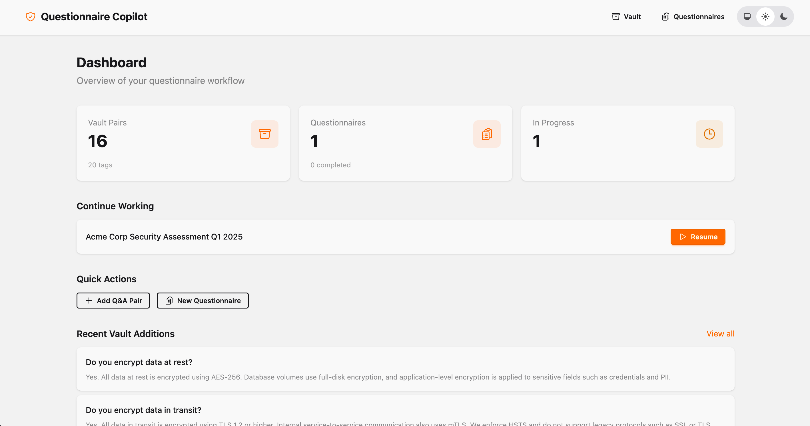
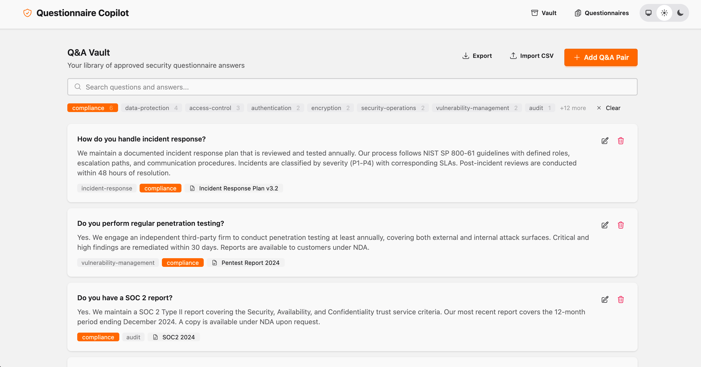
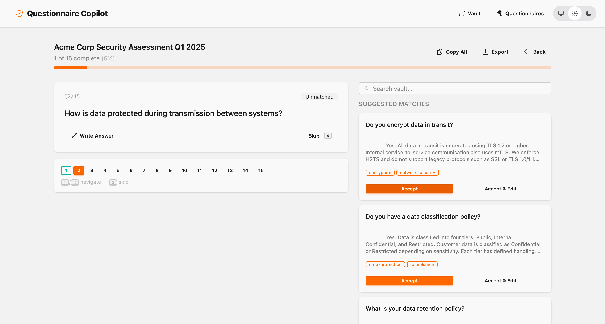
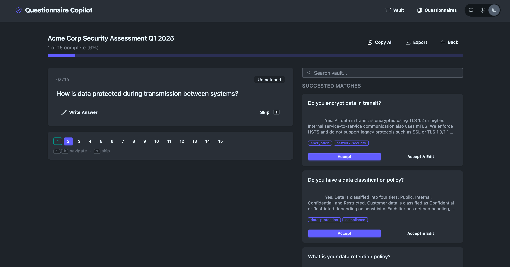

# Questionnaire Copilot

[](https://github.com/0x4rch/questionnaire-copilot/actions/workflows/ci.yml)


A self-hosted Phoenix LiveView application that helps security/compliance professionals answer vendor security questionnaires faster by maintaining a searchable library of canonical Q&A pairs and matching them against incoming questionnaires.

---

## Screenshots

| Dashboard | Q&A Vault |
|:-:|:-:|
|  |  |

| Answering Interface | Dark Mode |
|:-:|:-:|
|  |  |

## Features

- **Q&A Vault** — Maintain a searchable library of approved answers with tags and sources
- **Questionnaire Import** — Paste questions or upload CSV to create questionnaires
- **Smart Matching** — Trigram similarity matching suggests relevant vault answers for each question
- **Answering Workflow** — Accept, edit, skip, or write answers with keyboard shortcuts (j/k/s)
- **Vault Search** — Search the vault by question or answer text from within the answering flow
- **Tag Filtering** — Filter vault by clickable tags with counts
- **Save to Vault** — Prompted to save new answers that aren't in the vault yet
- **CSV Import/Export** — Import Q&A pairs and questionnaires from CSV, export completed questionnaires
- **Copy to Clipboard** — Copy all answered Q&A pairs in one click
- **Dashboard** — Overview of vault size, questionnaire progress, and quick actions
- **Dark Mode** — Full dark/light/system theme support
- **Drag & Drop** — File uploads support drag and drop (zero custom JS)

## Tech Stack

| Component | Version |
|-----------|---------|
| Elixir | 1.19+ (OTP 28) |
| Phoenix | 1.8 with LiveView |
| PostgreSQL | 18 with pg_trgm |
| CSS | Tailwind + daisyUI |
| JavaScript | None (just LiveView) |

## Prerequisites

- Erlang/OTP 28+
- Elixir 1.19+
- Docker & Docker Compose (for PostgreSQL)

### Installing Erlang & Elixir

Using [mise](https://mise.jdx.dev/):

```bash
mise use erlang@28 elixir@1.19
```

Or [asdf](https://asdf-vm.com/):

```bash
asdf plugin add erlang
asdf plugin add elixir
asdf install erlang 28.4.1
asdf install elixir 1.19.5-otp-28
asdf set erlang 28.4.1
asdf set elixir 1.19.5-otp-28
```

## Getting Started

```bash
# Clone the repo
git clone https://github.com/0x4rch/questionnaire-copilot.git
cd questionnaire-copilot

# Start PostgreSQL
docker compose up -d

# Install dependencies and set up database
mix setup

# Seed sample data (optional)
mix run priv/repo/seeds.exs

# Start Phoenix server
mix phx.server
```

Visit [localhost:4000](http://localhost:4000).

## Development

```bash
# Run tests
mix test

# Start interactive shell with server
iex -S mix phx.server

# Reset database
mix ecto.reset

# Format code
mix format
```

## CSV Formats

### Vault Import (Q&A Pairs)

```csv
question,answer,tags,source
Do you encrypt data at rest?,Yes. AES-256 encryption.,encryption;data-protection,SOC2 2024
```

Tags are semicolon-separated within the field.

### Questionnaire Import

```csv
question,category
Do you have a formal security policy?,governance
How do you handle incident response?,operations
```

Only the `question` column is required; other columns are ignored.

## Roadmap

- [ ] Semantic search with embeddings (pgvector)
- [ ] AI answer drafting with Claude API
- [ ] Bulk auto-processing of questionnaires
- [ ] Authentication for multi-user deployment

## Contributing

1. Fork it
2. Create your feature branch (`git checkout -b feature/my-feature`)
3. Commit your changes (`git commit -am 'Add my feature'`)
4. Push to the branch (`git push origin feature/my-feature`)
5. Open a Pull Request

## License

MIT
